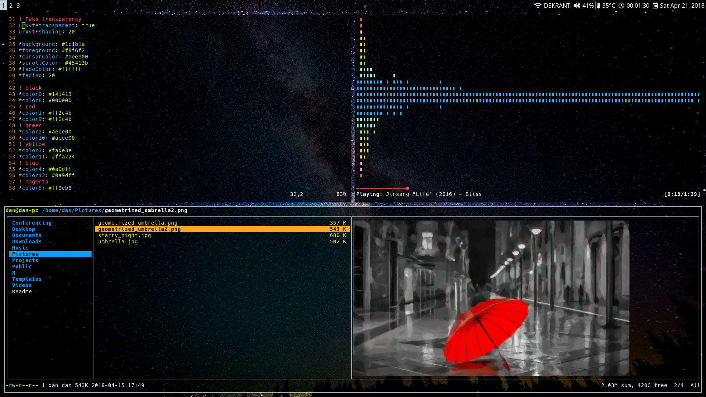

# i3-config
Just my personal config files for i3-gaps. I use urxvt for the terminal and
i3blocks with i3status for the status bar. I may consider switching to polybar 
in the future for a replacement bar.

My ncmpcpp config files are located in my normal dotfiles repo as I frequently
use it with GNOME as well.

Gratuitous screenshot below :

